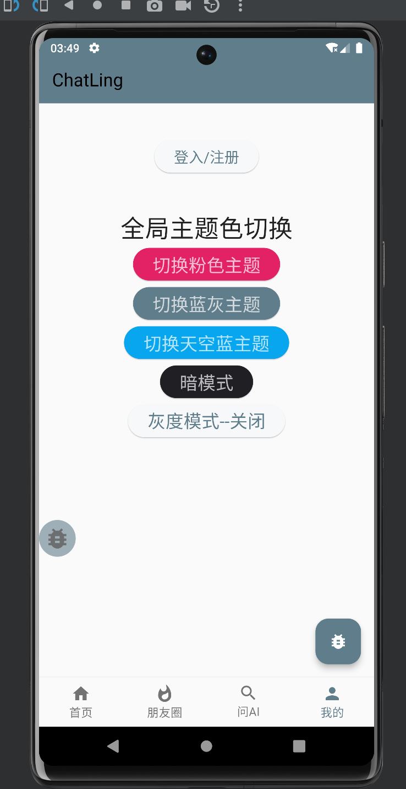
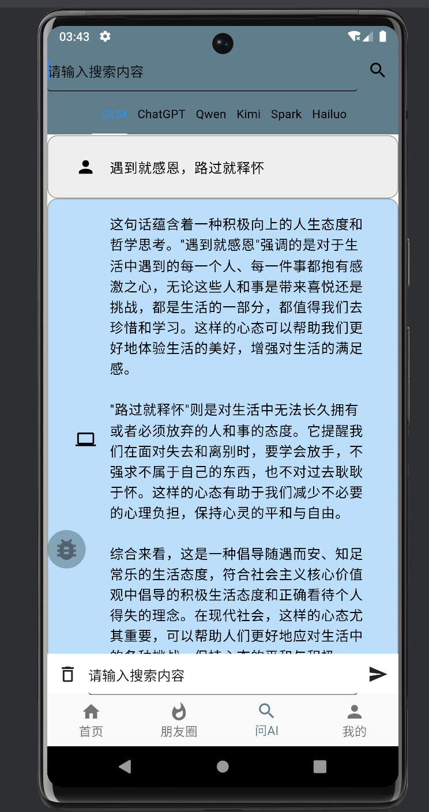

# ChatLing
flutter基于flexible 脚手架开发的AI朋友圈评论和向AI提问多LLM回答。

## 项目介绍
AI朋友圈评论：发表朋友圈，AI基于GLM模型根据prompt扮演角色评论用户朋友圈信息。
向AI提问多LLM回答：问题发给AI，GLM、ChatGPT35、Kimi、Qwen、Spark等LLM模型回答问题，基于LLM Red Team的API。

【项目已经停止更新】
AI迭代发展迅猛，希望能开发出更有创意的产品，为工作学习提速增效，而不是开发搭建ChatGPT聊天客户端产品。

## 效果示例

  

  

  

  

